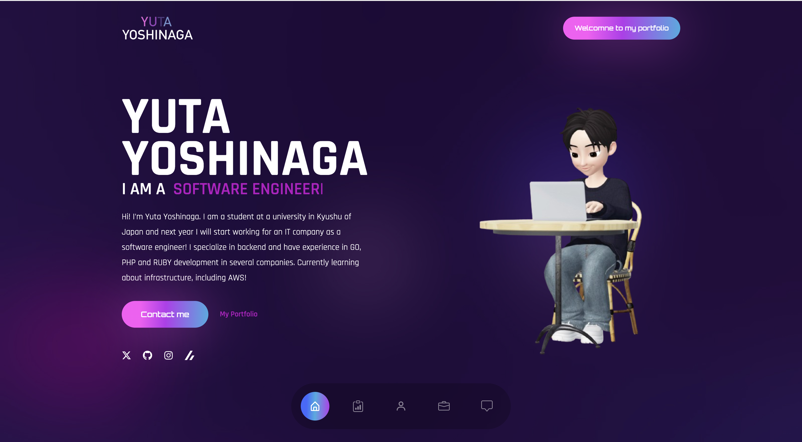

# Portfolio - Next.js

[](https://github.com/Yu-326-ta/portfolio/actions/workflows/frontend.yml)
[](https://github.com/Yu-326-ta/portfolio/actions/workflows/deploy.yml)

## 概要

ReactからNext.js 14への移行プロジェクトです。UIとアニメーションを維持しながら、最新のNext.jsとshadcn/uiを使用して再構築しました。

## 技術スタック

- **Next.js 14** - App Router使用
- **TypeScript** - 型安全な開発
- **Tailwind CSS** - スタイリング
- **shadcn/ui** - UIコンポーネント
- **Framer Motion** - アニメーション
- **Vercel Analytics** - 分析

## 開発コマンド

```bash
# 開発サーバー起動
npm run dev

# ビルド
npm run build

# プロダクションサーバー起動
npm start
```

## ディレクトリ構造

```
app/          # Next.js App Router
components/   # Reactコンポーネント
├── ui/       # shadcn/uiコンポーネント
lib/          # ユーティリティ関数
public/       # 静的ファイル
```

## Image

